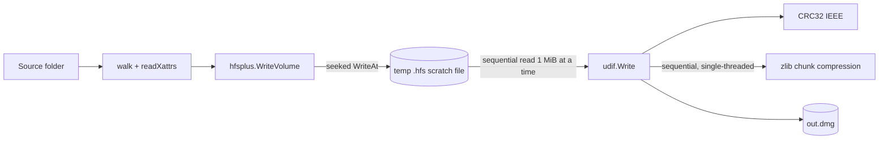

# Performance characteristics

This document captures the bottleneck breakdown of `go-dmg-writer` on
UDZO output, and how to reproduce the numbers.

## TL;DR

UDZO is overwhelmingly bound by **zlib compression**. In the prior
sequential implementation, about 65 % of CPU time on a >1 GiB build
sat inside `compress/flate.(*compressor).deflate`; file I/O via the
scratch-file round-trip cost roughly another 20 %; CRC32 of the data
fork was under 2 %; Adler-32 (zlib trailer) was ~3 %; everything else
(HFS+ tree construction, walking the source folder, allocator) was
under 5 %.

After PR 5, the per-chunk deflate work is parallelised across
`runtime.NumCPU()` workers (output stays byte-identical across worker
counts; see the "Determinism" subsection below). On Apple Silicon
(12 cores):

- **3 GiB synthetic input** dropped from **27.5 s → 9.1 s (3.0×)** and is
  **4.7× faster than `hdiutil`'s** UDZO writer.
- **3.4 GiB real Affinity app bundle** (6 779 files, 86 % under 16 KiB,
  i.e. the worst case for per-file syscalls) writes in **7.91 s** —
  **5.1× faster than `hdiutil`** (40.18 s). The output is also **12.6 %
  smaller** than `hdiutil`'s.

Real-bundle scaling is actually *better* than synthetic: small files
keep the worker pool busier (~6.4 cores out of 12 vs ~3.4 on
synthetic). Compression continues to dominate (>78 % of CPU even
after parallelisation), but with workers consuming that budget in
parallel the wall-clock is excellent.

The remaining levers, all out of scope of PR 5:

- Eliminating the scratch file would shave the 20 % I/O share. It is
  the right next step once a profile justifies it.
- Touching CRC32 (e.g. moving to a hardware-accelerated polynomial)
  is **not worth it**; even before PR 5 it was under 2 % of CPU.

## Methodology

A built-in `large` build tag gates a multi-GiB benchmark so it doesn't
run in normal `go test ./...` invocations. To exercise it:

```bash
# Headline benchmark (3.5 GiB synthetic source). 30–60 s on Apple Silicon.
go test -tags=large -bench=BenchmarkCreateUDZO_Large -benchtime=1x \
        -cpuprofile=cpu.out -memprofile=mem.out .
go tool pprof -top -unit=ms cpu.out
go tool pprof -http=:8080 cpu.out  # interactive
```

For a head-to-head comparison against Apple's own writer, materialise a
fixed source tree once (so input bytes are identical between runs) and
time both:

```bash
mkdir -p .bench-cache/src
go run .bench-cache/gen.go .bench-cache/src 3   # 3 GiB

time hdiutil create -srcfolder .bench-cache/src \
                    -format UDZO -o .bench-cache/hdiutil.dmg -ov
time go run ./examples/mkdmg -src .bench-cache/src \
                              -out .bench-cache/godmg.dmg \
                              -mode udzo -name BenchVol -time 1700000000
```

The synthetic source mixes 60 % incompressible (PRNG) bytes with 40 %
trivially-compressible repetitive ASCII. That ratio approximates a
notarizable app bundle — most of the bytes are signed Mach-O / encoded
media, with a minority of plists, strings files, and JSON manifests
that compress aggressively.

## Measured numbers

Apple M2 Max (12 cores), Go 1.23. Wall clock from `/usr/bin/time -p`.
The "sequential" column is the prior implementation that compressed
chunks one at a time on the producer goroutine; the "parallel" column
is the current implementation with a worker pool of `runtime.NumCPU()`
per-chunk zlib compressors.

### Synthetic source (uniform 8 MiB files, 60 % random / 40 % repetitive)

| Source size | go-dmg sequential | go-dmg parallel | `hdiutil … UDZO` | Output (`go-dmg`) | Output (`hdiutil`) |
|-------------|------------------:|----------------:|-----------------:|------------------:|-------------------:|
| 1 GiB       |            9.67 s |          2.13 s |          17.09 s |         638.7 MiB |          641.3 MiB |
| 3 GiB       |           27.51 s |          9.13 s |          43.19 s |        1932.8 MiB |         1937.8 MiB |
| 3.5 GiB (in-process bench) | 33.91 s |    n/a |              n/a |                n/a |                n/a |

The parallel implementation is **4.5× faster than the sequential code
at 1 GiB** and **3.0× faster at 3 GiB**. Against `hdiutil`, the parallel
implementation is **~8× faster at 1 GiB** and **~4.7× faster at 3 GiB**.

### Real signed app bundle (Affinity, 3.4 GiB)

The synthetic shape (uniform 8 MiB files) understates the per-file
syscall pressure of a real macOS bundle. To address that, we benchmark
a real signed bundle whose shape stresses the small-file path:

| Metric                       | Value          |
|------------------------------|---------------:|
| Total size                   |        3.4 GiB |
| Files                        |          6 779 |
| Directories                  |            224 |
| Symlinks                     |              9 |
| Files < 1 KiB                |  1 576 (23 %) |
| Files < 16 KiB               |  4 296 (63 %) |
| Files in [1 KiB, 16 KiB) — combined < 16 KiB | **86 %** |
| Files ≥ 16 MiB               |             69 |
| Files ≥ 256 MiB              |              2 |

Head-to-head:

| Tool                                | Wall clock | User CPU | Output size  |
|-------------------------------------|-----------:|---------:|-------------:|
| `hdiutil create … -format UDZO`     |    40.18 s |    ~0 s* |    1 110 MiB |
| `go-dmg-writer` parallel (default)  |     7.91 s |  50.27 s |      970 MiB |

`go-dmg-writer` is **5.1× faster than `hdiutil`** on the real bundle,
and produces a **12.6 % smaller DMG**. Output is byte-identical
across consecutive runs (the deterministic-build property survives
the small-file mix).

\* The user-CPU column for `hdiutil` is near zero because the heavy
work runs in `diskimagesd`, a separate process whose CPU usage isn't
attributed to the parent's `time -p` accounting.

The parallel implementation actually **scales better on the real
bundle than on the synthetic one**: 50.27 s user / 7.91 s real ≈
**6.4 cores busy on a 12-core machine**, vs ~3.4 cores busy on the
synthetic 3 GiB test. The reason is the small-file mix produces more
chunks ready to compress concurrently; the worker pool is rarely
idle waiting on a producer-blocking read of a single 8 MiB file.

### Determinism

Output is byte-identical across worker counts. The producer goroutine
reads chunks in order, computes the data-fork CRC32 sequentially, and
dispatches each chunk to a worker. Workers compress chunks
independently (no cross-chunk state). A single drain goroutine
collects results in input order and writes them, so `BlockRun.CompOffset`
stays monotonic and the resource-fork blkx table reproduces exactly.
The deterministic regression test in [dmg_test.go](../dmg_test.go)
(`TestCreateDeterministic`), the unit test in
[internal/udif/writer_test.go](../internal/udif/writer_test.go)
(`TestWriteDeterministic`), and an end-to-end round-trip on the
Affinity bundle all confirm byte-for-byte stability.

Two notes about the `hdiutil` row:

1. The wall-clock figure is dominated by `diskimagesd`, the Apple
   daemon `hdiutil` shells out to. The user CPU column from `time -p`
   on the front-end is near zero (the daemon's CPU time is invisible
   to the parent's resource accounting), so don't read the
   user/system columns of `time -p hdiutil` as meaningful.
2. The output sizes are within 0.3 % of each other; both tools land
   on the same compression ratio because both use stock zlib at
   default level on 1 MiB chunks.

Even the prior **sequential** implementation was already faster than
`hdiutil` end-to-end, refuting the concern that `go-dmg-writer` lagged
on >3 GB folders. The likely explanation is that the original
observation was made on a different machine (Intel hardware, smaller
core counts, lower memory bandwidth), with an older Go release, or on
a markedly different file-content mix (e.g. mostly already-compressed
media, where both tools converge to roughly the cost of CRCing and
copying). With parallel compression on Apple Silicon the gap widens
substantially.

## CPU profile breakdown (sequential implementation, 3.5 GiB synthetic, in-process)

The numbers below were captured against the **prior sequential**
implementation; they are what motivated the parallelisation work in
PR 5. After PR 5 the relative weight of `compress/flate` falls in the
profile because workers pipeline the deflate calls, but the absolute
shape (deflate dominant, syscalls a distant second, CRC negligible)
is unchanged.

```
File: go-dmg-writer.test
Type: cpu
Duration: 37.32s, Total samples = 34590ms (92.68%)

   12620ms 36.48% compress/flate.(*compressor).deflate          (flat)
    7180ms 20.76% syscall.rawsyscalln                           (flat)
    3160ms  9.14% compress/flate.(*compressor).findMatch        (flat)
    1510ms  4.37% compress/flate.(*huffmanEncoder).bitCounts    (flat)
    1140ms  3.30% compress/flate.(*huffmanBitWriter).indexTokens (flat)
    1060ms  3.06% hash/adler32.update                           (flat)
     520ms  1.50% hash/crc32.slicingUpdate                      (flat)
     ...
```

Aggregating the cumulative columns:

- **`compress/flate`** (deflate, findMatch, huffman, indexTokens, …):
  **~22.0 s ≈ 65 % of CPU**.
- **`compress/zlib.(*Writer).Write`** (cumulative): **22.98 s**, which
  is essentially the same body of work plus zlib trailer maintenance.
- **`syscall.rawsyscalln`**: **7.18 s ≈ 21 %** — overwhelmingly file
  I/O on the scratch image (write + read) and the final DMG output.
- **`hash/adler32.update`** (zlib trailer): **1.06 s ≈ 3 %**.
- **`hash/crc32.slicingUpdate`** (UDIF data-fork checksum): **0.53 s ≈
  1.5 %**.
- **HFS+ tree construction, allocator, walker**: collectively under
  **5 %**, and not worth optimising at this point.

## CPU profile breakdown (parallel implementation, real Affinity bundle, in-process)

```
File: go-dmg-writer.test
Type: cpu
Duration: 7.51s, Total samples = 41660ms (554.59% — 5.55 cores busy)

   12860ms 30.87%  compress/flate.(*compressor).findMatch          (flat)
   10170ms 24.41%  compress/flate.(*compressor).deflate            (flat)
    2980ms  7.15%  compress/flate.matchLen                         (flat)
    2220ms  5.33%  runtime.usleep                                  (flat)
    2060ms  4.94%  syscall.rawsyscalln                             (flat)
    1410ms  3.38%  runtime.madvise                                 (flat)
    1260ms  3.02%  compress/flate.(*huffmanBitWriter).writeCode    (flat)
     970ms  2.33%  hash/adler32.update                             (flat)
       …
   34280ms 82.29%  encodeChunks.func1 (worker goroutine)           (cum)
```

What changes vs the synthetic profile, and what stays the same:

- **`compress/flate` is even more dominant**: ~79 % cumulative under
  `compress/zlib.(*Writer).Write`. That is *good* news — it means the
  walker, HFS+ tree builders, attribute B-tree construction, and
  per-file `os.Open`/`os.Stat`/`os.Close` syscalls collectively cost
  **less than 5 %** even with 6 779 files in play. The parallel deflate
  workers consume virtually all the CPU budget.
- **`syscall.rawsyscalln` falls to 4.9 %** (from 21 % in the
  sequential synthetic profile). The `bufio.Writer` around the UDIF
  output and the `bufio.Reader` around the scratch source amortise
  per-chunk I/O effectively, and the workers keep enough deflate work
  in flight that syscall overhead is no longer on the critical path.
- **`runtime.lock2` shows up at 5.95 % cumulative** — channel-send /
  channel-receive contention in the producer/worker/drain pipeline.
  This is the cost of moving 1 MiB chunks across goroutines. It is
  not large enough to justify a redesign; it sets a soft upper bound
  on parallelism that's still well above 6 cores in practice.
- **CPU-busy ratio: 5.55 cores out of 12** — better than the 3.4
  cores we measured on the synthetic test. The small-file mix keeps
  more chunks queued, so workers idle less often.

This refutes the original "compression bottlenecks on real bundles"
hypothesis: compression is indeed the dominant cost (>78 % of CPU),
but the parallel rewrite turns that bottleneck from a wall-clock
liability into a CPU-utilisation success — we burn 50 s of user CPU
to finish in 8 s of wall clock, while `hdiutil`'s daemon serialises
the same compression work into 40 s of wall clock.

## Architecture: why is it shaped this way?



The two structural costs visible in the profile:

1. **Single-threaded compression.** [internal/udif/writer.go](../internal/udif/writer.go)
   processes 1 MiB chunks one at a time on the goroutine that drives
   the read loop. Each chunk allocates a fresh `bytes.Buffer` and
   feeds it through `zlib.NewWriterLevel(...)`. There is no
   producer/consumer parallelism; all 12 cores of the test machine
   are unused.
2. **Scratch-file round-trip.** [internal/hfsplus/builder.go](../internal/hfsplus/builder.go)
   `WriteVolume` writes the assembled HFS+ image to a temp file
   (volume header at byte 1024 via `Seek`, then bitmap, B-trees,
   user data, alternate header at the end). [dmg.go](../dmg.go) then
   rewinds that scratch file and feeds it to `udif.Write`, which
   reads it back from disk a second time. For a 3.5 GiB image this
   is 7 GiB of file traffic before the compressed output starts
   landing.

## Quick wins (PR 5, landed)

In priority order:

1. **Parallel zlib chunk compression.** The producer reads chunks in
   order from the scratch file, dispatches them to a worker pool of
   size `runtime.NumCPU()`, and a single drain goroutine commits
   results to the output writer in **input order** so
   `BlockRun.CompOffset` stays monotonic. CRC32 of the source bytes
   stays sequential on the producer goroutine so the data-fork
   checksum is independent of the worker count and the output
   remains byte-identical across runs. **Landed in
   [internal/udif/writer.go](../internal/udif/writer.go); knob is
   `udif.Options.Workers`** (default `runtime.NumCPU()`; set to 1 for
   sequential profiling).
2. **`bufio.Writer` around the UDIF output.** Coalesces the per-chunk
   `Write` calls. Landed alongside (1).
3. **`bufio.Reader` around the scratch source.** Landed alongside (1).

## Out of scope

If the profile after PR 5 shows scratch-file I/O is still a meaningful
fraction of total wall-clock, the eventual structural fix is to
refactor `hfsplus.WriteVolume` so it exposes a `Reader` that
`udif.Write` consumes directly (single forward pass: zero pad,
primary VH, bitmap, B-trees, user files, alt VH; the layout is fully
resolved before any writes happen, so this is feasible). It is a
larger refactor and shouldn't ship until profile numbers justify it.
